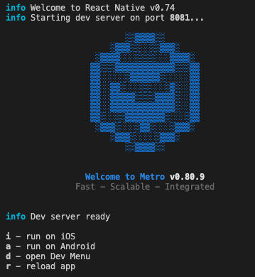

# BeerSupplyApp

Instructions for setting up and running the project.

## Step 1: Install dependencies
```bash
# Install with npm
npm install
# Install pods
cd ios
pod install
```

## Step 2: Start metro bunlder
In a separated terminal run
```bash
# using npm
npm start
```

## Step 3: Run Simulator/Emulator
At this point, you should be able to run the app in the iOS simulator or in the Android emulator by typing i or a respectively.



You can also run directly from xCode or Android Studio.